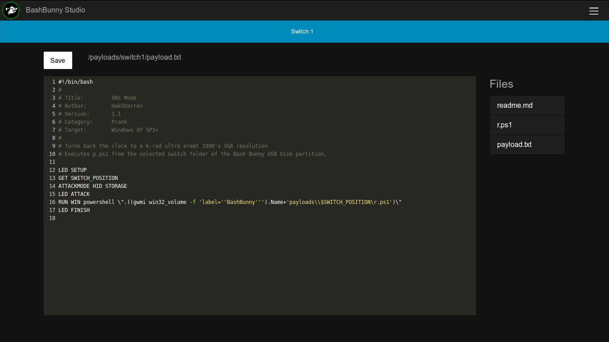
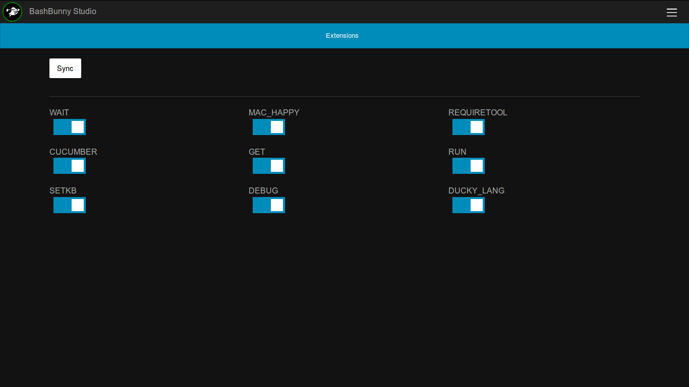
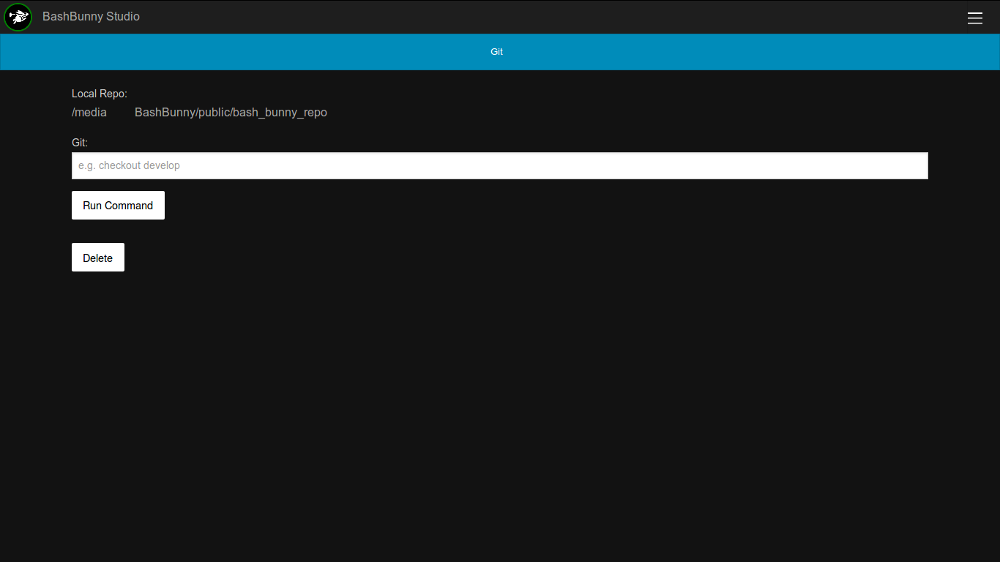
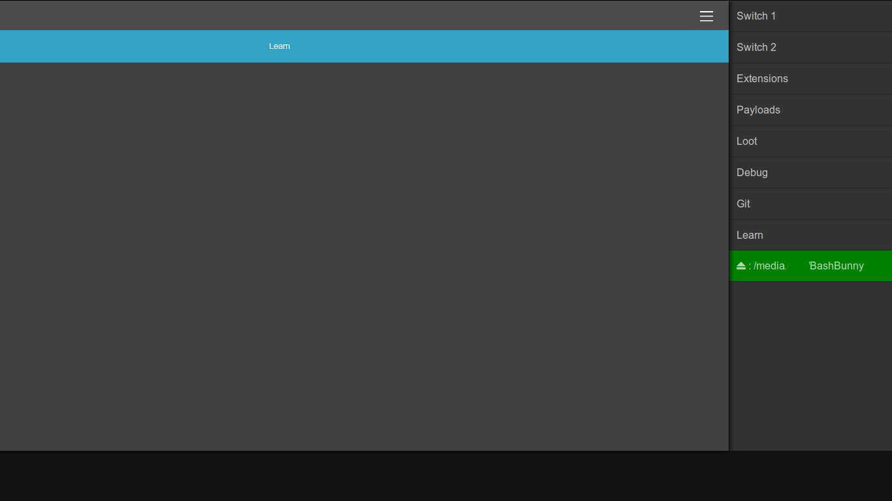
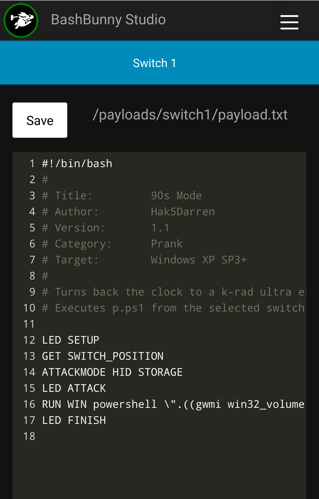

# BashBunny Studio

This a web-based IDE to manage the Bash Bunny.

It can run on any host, and allows you to mount/unmout the bunny, clone a BB github repo, one-click copy payloads to either switch, in-browser edit payloads, manage extensions, and view debug logs.

**Setup**
- Install Ruby
- Clone this Repo
- `bundle install`
- `rails s`
- Use the tool @ http://localhost:3000

